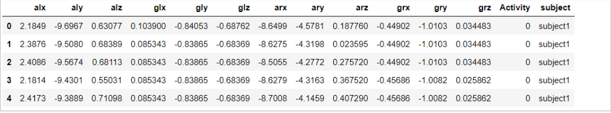
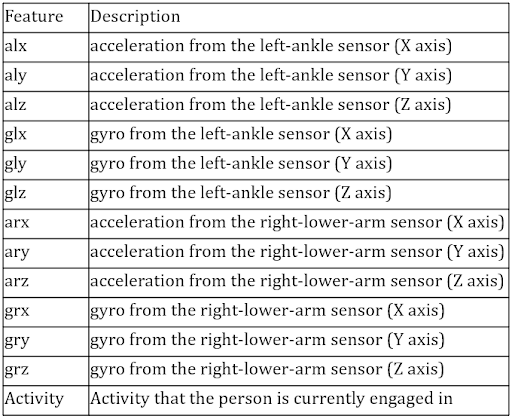
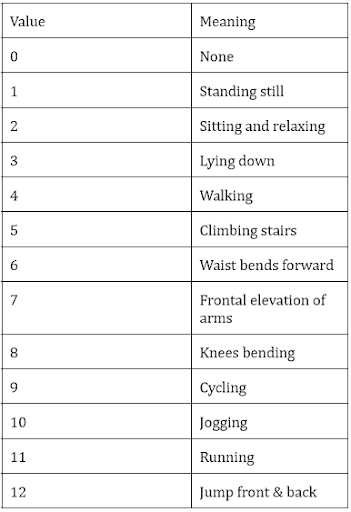
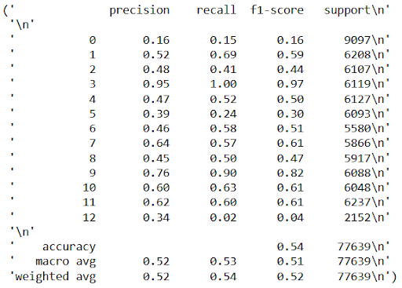
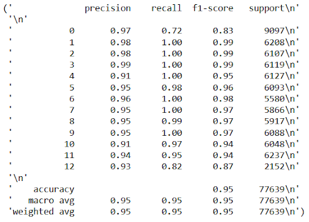
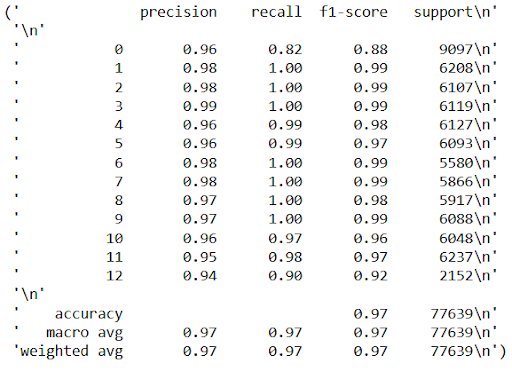

# DSCI521
# Human Activity Prediction based on sensor Data

<h1> Note: The notebook has large Visualisations with Plotly, hence couldn't be directly uploaded onto GIT alongwith outputs.
To view the notebook please visit</h1> <b><a href="https://tanmai14.github.io/DSCI521/Project.html">https://tanmai14.github.io/DSCI521/Project.html</a></b>

This Project is aimed at developing a ML model about the user's physical activity based on sensor data. Primarily there are Two main sensors used to generate the dataset: Gyroscope and Accelerometer

Gyroscope : For identifying Position in 3D space

Accelerometer: For measuring Acceleration in 3D Space

## Introduction

The dataset titled "Physical Activity Prediction," available on the UCI Machine Learning Repository, provides a collection of physiological and movement data of individuals recorded through wearable sensors. The dataset aims to make it possible to create predictive models for each person's level of physical activity. Accurate prediction of activity levels is crucial for tailoring health interventions because physical activity has been shown to have a significant impact on overall health and well-being. The dataset includes data from different sensors, including accelerometer and gyroscope measurements, as well as demographic data. The target variable in this dataset is the level of physical activity, which is divided into five categories ranging from very active to sedentary. The dataset can be used in a number of ways, such as to make activity tracking systems, tailor-made fitness plans, and find risk factors for different illnesses.

The mHealth (Mobile Health) dataset is a publicly available dataset from the Machine Learning Repository of the University of California, Irvine (UCI). The dataset was collected as part of a research project aimed at developing machine learning algorithms for human activity recognition using mobile sensors. The dataset contains sensor readings from 10 different sensors on a smartphone and a smartwatch worn by the participants, while they performed different physical activities. The mHealth dataset contains data from 10 participants, who were asked to perform 12 different physical activities, including walking, standing, jumping, and cycling. The dataset includes a total of 27,000 instances, with each instance consisting of 23 sensor readings and a label that indicates the corresponding activity. The sensor data was collected at a sampling rate of 50 Hz, resulting in a total of 23 sensor features for each instance. The sensors included in the dataset are the accelerometer, gyroscope, and magnetometer of the smartphone and smartwatch. The data was preprocessed to remove noise and the effect of gravity, resulting in a clean and standardized dataset for machine learning analysis. The targeted variable in the dataset holds the values of the general activities like standing still, lying down, walking, climbing stairs, cycling, jogging or running and many more.

## Potential applications

* Assist Smart Wearables manufacturers to bring-in exciting features like Workout Monitoring, Calorie Tracking.

* Develop Applications which can monitor the efficiency with which muscles contract and expand during workout

* Disrupt the robotic limbs industry, as it can assist people with disabilities in smartly in pre-maturely predicting the movement being made

## Dataset

* The dataset is publicly available on UCI.

* The dataset contains sensor readings from 2 different sensors worn by the participants, while they performed different physical activities.

* It contains data from 10 participants, who were asked to perform 12 different physical activities, including walking, standing, jumping, and cycling.

* Each instance in the dataset consists of 12 sensor readings and a label that indicates the corresponding activity.

* The sensors included in the dataset are the accelerometer and a gyroscope attached to the right wrist and left ankle of the subject.

## Sample Data Set

## Attributes in the dataset

## Categories of Activities recorded

## Models used

* Logistic Regression
* K-Nearest Neighbors
* Random Forest Classifier

## Results

### Logistic Regression Results

### KNN Results

### Random Forest Results

## Requirements 

* Jupyter notebook
* Pandas
* Numpy
* Plotly
* Matplotlib
* Sklearn

## How to execute

* Download the project.ipynb file along with the dataset data.csv. Ensure all the above requirements are installed and then, open the notebook in jupyternotebook and click 'Run all'.

## Challenges Faced & Future Scope

* The axis of the sensors is not clearly mentioned, making it difficult to manually visualize the movement, which creates confusion.

* The data is unevenly distributed, with most of the data falling into Activity 0, which is None. To address this, we downsampled the data.

* If we include a heart rate sensor in this experiment, we could improve the project further.

* It is challenging to predict extra activities using only multiple predefined activities.
